  
  
  
  
  
  

# Hi My name is Santosh Pathak

I am a passionate **Full Stack Developer** currently working at **Tedekstra, UK**, specializing in building scalable enterprise applications using modern web technologies.

* 🌍  I'm based in UK (Remote) / India
* 🖥️  Check out my portfolio at [santosh-portfolio.vercel.app](https://santosh-pathak-portfolio.vercel.app/)
* ✉️  Contact me at [pathaksantosh987@gmail.com](mailto:pathaksantosh987@gmail.com)
* 🤝  Open to collaborating on projects and opportunities
* 💼  Currently working on enterprise CRM systems and real-time applications

---

## 🚀 About Me

I'm a passionate **Full Stack Developer** currently working at **Tedekstra, UK**, specializing in building scalable enterprise applications using modern web technologies. With a strong foundation in computer science and extensive experience in competitive programming, I've solved **1900+ problems** across various platforms and achieved **Top 5% global ranking**.

### 🎯 Current Focus
- **Enterprise CRM Systems** - Building comprehensive customer relationship management platforms
- **Real-time Applications** - Developing scalable job management and tracking systems
- **Cloud Infrastructure** - Working with Azure, Terraform, and modern DevOps practices
- **Performance Optimization** - Improving system performance by 25-40% through optimization techniques

---

## 💼 Professional Experience

### 🏢 **Full Stack Software Developer** @ [Tedekstra](https://tedekstra.com)
**Current | UK (Remote)**

Leading development of enterprise-level applications and CRM systems for UK-based clients. Working with Tedekstra's comprehensive offerings including bespoke software development, IT team augmentation, SaaS products, and managed IT services.

**Key Projects:**
- **Case Management CRM** - Comprehensive customer relationship management system with advanced case tracking and analytics
- **Jobber App** - Job management platform with real-time tracking, scheduling, and client communication features  
- **Energized Earth CRM** - Specialized CRM for managing opportunities, jobs, tasks, leads, and conversion reports

**Technologies:** TypeScript, Next.js, Node.js, MongoDB, Express.js, Redis, Azure, Terraform, Grafana

**Achievements:**
- ✅ Delivered 3 major CRM projects within tight deadlines
- ✅ Improved system performance by 40% through optimization
- ✅ Implemented secure authentication and role-based access control
- ✅ Collaborated with international teams across UK and India

### 🎓 **Software Engineer Intern** @ Technology Business Incubator - Graphic Era (GEU)
**Jul 2024 - Oct 2024 | Dehradun, UK**

Developed full-stack applications using MERN stack technologies with focus on scalability and performance.

**Key Projects:**
- **JobHunt Website** - Full-stack job-seeking platform enabling 500+ recruiters to efficiently post jobs & manage applicants

**Technologies:** MongoDB, Express.js, React.js, Node.js, Redis, Jenkins

**Achievements:**
- ✅ Reduced system latency by 25% with efficient API handling and caching mechanisms
- ✅ Enhanced authentication security by integrating JWT & OAuth 2.0
- ✅ Optimized deployment pipelines with CI/CD automation
- ✅ Successfully delivered two major projects within internship period

---

## 🛠️ Tech Stack

### 🎨 **Frontend Development**

### ⚙️ **Backend Development**

### 🗄️ **Database & Cloud**

### 🔧 **DevOps & Tools**

---

## 🏗️ Tech Stack Architecture

```mermaid
graph TB
    subgraph "Frontend Layer"
        A[React.js] --> B[Next.js]
        B --> C[TypeScript]
        C --> D[Tailwind CSS]
    end
    
    subgraph "Backend Layer"
        E[Node.js] --> F[Express.js]
        F --> G[RESTful APIs]
        G --> H[WebSockets]
    end
    
    subgraph "Database Layer"
        I[MongoDB] --> J[Redis Cache]
        J --> K[MySQL]
    end
    
    subgraph "Cloud & DevOps"
        L[Azure] --> M[Terraform]
        M --> N[Docker]
        N --> O[Jenkins]
        O --> P[Grafana]
    end
    
    A --> E
    E --> I
    I --> L
    
    style A fill:#61DAFB
    style B fill:#000000
    style C fill:#007ACC
    style E fill:#43853D
    style F fill:#404D59
    style I fill:#4EA94B
    style L fill:#0078D4
```

---

## 🎓 Education

**📍 Location:** Dehradun, UK  
**🎯 Focus:** Computer Science & Software Engineering  

### 📚 **Relevant Coursework**

  

---

## 💼 Professional Experience

### 🏢 **Current Role**

### 🎓 **Previous Experience**

**Key Achievements:**
- ✅ Architected and deployed the **JobHunt Website**, a full-stack job-seeking platform using the MERN stack, reducing system latency by **25%** with efficient API handling and caching
- ✅ Enhanced authentication security by integrating **JWT & OAuth 2.0** and optimized deployment pipelines with **CI/CD automation**
- ✅ Collaborated with a team to deliver **two major projects** during the internship period
- ✅ Implemented **scalable architecture** and **performance optimization** techniques  

---

## 🚀 Featured Projects

### 💼 **Professional Projects**

| 🏢 **JobHunt Platform** | 🎥 **VideoTube Clone** | 💰 **Xcrypto Tracker** |
|:---:|:---:|:---:|
|     |     |    |
| **500+ Recruiters** | **Real-time Streaming** | **35% Faster API** |

### 📋 **Project Details**

<b>🏢 JobHunt – Job Seeking & Posting Platform</b>

**Technologies:** MongoDB, Express.js, React.js, Node.js, Redis, Jenkins

**Key Features:**
- ✅ Engineered a scalable job-seeking platform enabling **500+ recruiters** to post jobs and manage applicants efficiently
- ✅ Implemented **JWT-based authentication** and role-based access control for secure user sessions
- ✅ Integrated **cloud-based storage** for resume uploads and applicant data
- ✅ Reduced system latency by **25%** with efficient API handling and caching mechanisms

<b>🎥 VideoTube – A YouTube Clone</b>

**Technologies:** MongoDB, Express.js, React.js, Node.js, Cloudinary, JWT

**Key Features:**
- ✅ Developed a high-performance video streaming platform with real-time uploads, user authentication, and interactive features
- ✅ Designed a **scalable React.js frontend** with dynamic routing and a responsive UI
- ✅ Built **RESTful APIs** using Node.js & Express.js for seamless communication
- ✅ Integrated **Cloudinary** for efficient video storage and streaming

<b>💰 Xcrypto – Real-Time Cryptocurrency Market Tracker</b>

**Technologies:** React.js, Axios, CoinGecko API, Chart.js, Tailwind CSS

**Key Features:**
- ✅ Created a real-time cryptocurrency tracker with a responsive GUI and interactive charts for price trends and market data
- ✅ Optimized API requests, reducing data fetching latency by **35%** using caching and paging
- ✅ Implemented **real-time price alerts** and market analysis dashboard
- ✅ Built **mobile-responsive design** with modern UI/UX

  

---

## 💻 Technical Skills

### 🎯 **Skills Overview**

| 🗣️ **Languages** | 🎨 **Frontend** | ⚙️ **Backend** | 🛠️ **Tools** | 🗄️ **Databases** |
|:---:|:---:|:---:|:---:|:---:|
|      |      |     |     |    |

  

---

## 🏆 Achievements

### 🎯 **Competitive Programming**

### 🏅 **Competition Highlights**

| 🥇 **AIR-1** | 🥈 **2nd Place** | 🎯 **Top 5%** | 📊 **800+ Problems** |
|:---:|:---:|:---:|:---:|
| Coding Ninjas Ninja Dominator | Hack-o-Holic 24h Hackathon | LeetCode Global Ranking | GeeksForGeeks Solved |

### 🦈 **GitHub Achievements**

- **🦈 Pull Shark x2** - Successfully opened and merged pull requests on GitHub
- **📊 Active Contributor** - Consistent contributions to open source projects
- **🔗 Achievement Link**: [GitHub Pull Shark Achievement](https://github.com/users/Santosh-Pathak/achievements/pull-shark)  

---

## 📜 Certifications

  

---

## 📬 Let's Connect!

### 🌐 **Social Media**

 
 
 
 

## 📊 GitHub Analytics

 
 

  

---
## � Activity Graph

---

