# 👋 Hi there, I'm Santosh Pathak!

---

## 🚀 About Me

I'm a passionate **Full Stack Developer** currently working at **Tedekstra, UK**, specializing in building scalable enterprise applications using modern web technologies. With a strong foundation in computer science and extensive experience in competitive programming, I've solved **1900+ problems** across various platforms and achieved **Top 5% global ranking**.

### 🎯 Current Focus
- **Enterprise CRM Systems** - Building comprehensive customer relationship management platforms
- **Real-time Applications** - Developing scalable job management and tracking systems
- **Cloud Infrastructure** - Working with Azure, Terraform, and modern DevOps practices
- **Performance Optimization** - Improving system performance by 25-40% through optimization techniques

---

## 💼 Professional Experience

### 🏢 **Full Stack Software Developer** @ [Tedekstra](https://tedekstra.com)
**Current | UK (Remote)**

Leading development of enterprise-level applications and CRM systems for UK-based clients. Working with Tedekstra's comprehensive offerings including bespoke software development, IT team augmentation, SaaS products, and managed IT services.

**Key Projects:**
- **Case Management CRM** - Comprehensive customer relationship management system with advanced case tracking and analytics
- **Jobber App** - Job management platform with real-time tracking, scheduling, and client communication features  
- **Energized Earth CRM** - Specialized CRM for managing opportunities, jobs, tasks, leads, and conversion reports

**Technologies:** TypeScript, Next.js, Node.js, MongoDB, Express.js, Redis, Azure, Terraform, Grafana

**Achievements:**
- ✅ Delivered 3 major CRM projects within tight deadlines
- ✅ Improved system performance by 40% through optimization
- ✅ Implemented secure authentication and role-based access control
- ✅ Collaborated with international teams across UK and India

### 🎓 **Software Engineer Intern** @ Technology Business Incubator - Graphic Era (GEU)
**Jul 2024 - Oct 2024 | Dehradun, UK**

Developed full-stack applications using MERN stack technologies with focus on scalability and performance.

**Key Projects:**
- **JobHunt Website** - Full-stack job-seeking platform enabling 500+ recruiters to efficiently post jobs & manage applicants

**Technologies:** MongoDB, Express.js, React.js, Node.js, Redis, Jenkins

**Achievements:**
- ✅ Reduced system latency by 25% with efficient API handling and caching mechanisms
- ✅ Enhanced authentication security by integrating JWT & OAuth 2.0
- ✅ Optimized deployment pipelines with CI/CD automation
- ✅ Successfully delivered two major projects within internship period

---

## 🛠️ Tech Stack

### 🎨 **Frontend Development**

### ⚙️ **Backend Development**

### 🗄️ **Database & Cloud**

### 🔧 **DevOps & Tools**

### 💻 **Programming Languages**

---

## 🏗️ Tech Stack Architecture

```mermaid
graph TB
    subgraph "Frontend Layer"
        A[React.js] --> B[Next.js]
        B --> C[TypeScript]
        C --> D[Tailwind CSS]
    end
    
    subgraph "Backend Layer"
        E[Node.js] --> F[Express.js]
        F --> G[RESTful APIs]
        G --> H[WebSockets]
    end
    
    subgraph "Database Layer"
        I[MongoDB] --> J[Redis Cache]
        J --> K[MySQL]
    end
    
    subgraph "Cloud & DevOps"
        L[Azure] --> M[Terraform]
        M --> N[Docker]
        N --> O[Jenkins]
        O --> P[Grafana]
    end
    
    A --> E
    E --> I
    I --> L
    
    style A fill:#61DAFB
    style B fill:#000000
    style C fill:#007ACC
    style E fill:#43853D
    style F fill:#404D59
    style I fill:#4EA94B
    style L fill:#0078D4
```

---

## 🎓 Education
**Graphic Era Hill University**  
Bachelor of Science in Computer Science (8.00 CGPA)  
*Aug 2021 – June 2025 | Dehradun, UK*  

**Relevant Coursework**:  
- Data Structures & Algorithms  
- Database Management & Operating Systems  
- Object-Oriented Programming & Computer Architecture  

---

## 💼 Experience
### **Software Engineer Intern**  
**Technology Business Incubator - Graphic Era (GEU)**  
*Jul 2024 – Oct 2024 | Dehradun, UK*  
- Architected and deployed the **JobHunt Website**, a full-stack job-seeking platform using the MERN stack, reducing system latency by 25% with efficient API handling and caching.  
- Enhanced authentication security by integrating **JWT & OAuth 2.0** and optimized deployment pipelines with **CI/CD automation**.  
- Collaborated with a team to deliver **two major projects** during the internship.  

---

## 🚀 Projects

### **JobHunt – Job Seeking & Posting Platform**  
*MongoDB, Express.js, React.js, Node.js*  
- Engineered a scalable job-seeking platform enabling **500+ recruiters** to post jobs and manage applicants efficiently.  
- Implemented **JWT-based authentication** and role-based access control for secure user sessions.  
- Integrated **cloud-based storage** for resume uploads and applicant data.  

### **VideoTube – A YouTube Clone**  
*MongoDB, Express.js, React.js, Node.js*  
- Developed a high-performance video streaming platform with real-time uploads, user authentication, and interactive features.  
- Designed a **scalable React.js frontend** with dynamic routing and a responsive UI.  
- Built **RESTful APIs** using Node.js & Express.js for seamless communication.  

### **Xcrypto – Real-Time Cryptocurrency Market Tracker**  
*React.js, Axios, CoinGecko API*  
- Created a real-time cryptocurrency tracker with a responsive GUI and interactive charts for price trends and market data.  
- Optimized API requests, reducing data fetching latency by **35%** using caching and paging.  

---

## 💻 Technical Skills
**Languages**: Java, C, C++, JavaScript, SQL  
**Front-End**: React.js, Redux, HTML, CSS, Bootstrap, Shadcn-UI  
**Back-End**: Node.js, Express.js, RESTful APIs, WebSockets  
**Developer Tools**: Git, GitHub, VS Code, Eclipse, Postman, Cloudinary, Linux  
**Databases**: MongoDB, MySQL, Firebase  

---

## 🏆 Achievements

### 🎯 **Competitive Programming**

- **🥇 AIR-1** in Coding Ninjas Ninja Dominator Contest
- **🥈 2nd Place** in Hack-o-Holic 24-hour Hackathon
- **Top 5% globally** on LeetCode with 1100+ problems solved
- **800+ problems** solved on GeeksForGeeks

### 🦈 **GitHub Achievements**

- **🦈 Pull Shark x2** - Successfully opened and merged pull requests on GitHub
- **📊 Active Contributor** - Consistent contributions to open source projects
- **🔗 Achievement Link**: [GitHub Pull Shark Achievement](https://github.com/users/Santosh-Pathak/achievements/pull-shark)  

---

## 📜 Certifications
- **Master Data Structures & Algorithms** – CodeHelp  
- **Advanced C++ Programming** – Coursera  
- **MongoDB CRUD Mastery** – GeeksForGeeks  

---

## 📊 GitHub Stats
  
  

---
## � Activity Graph

---

## 📬 Let's Connect!
- **Email**: [pathaksantosh987@gmail.com](mailto:pathaksantosh987@gmail.com)  
- **LinkedIn**: [linkedin.com/in/santosh](https://www.linkedin.com/in/santosh-pathak987/)  
- **GitHub**: [github.com/Santosh-Pathak](https://github.com/Santosh-Pathak)  

---

---

✨ **Thanks for visiting my profile!** Feel free to explore my projects and reach out for collaborations or opportunities.  
<!--
**Santosh-Pathak/Santosh-Pathak** is a ✨ _special_ ✨ repository because its `README.md` (this file) appears on your GitHub profile.

Here are some ideas to get you started:

- 🔭 I’m currently working on ...
- 🌱 I’m currently learning ...
- 👯 I’m looking to collaborate on ...
- 🤔 I’m looking for help with ...
- 💬 Ask me about ...
- 📫 How to reach me: ...
- 😄 Pronouns: ...
- ⚡ Fun fact: ...
-->
